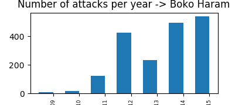

# Appendix

All the mid-results and other interesting results that we have found:
	
### Dependence of an attack being a suicide and a success:
	
- P(Success|Suicide)= 0.8928945713686859
- P(Success|not Suicide)= 0.9319741317491332
- P(Success * Suicide)= 0.027173219707600848
- P(Suicide)*P(Success)= 0.02749936858568745

The success of the attack is independent of whether the attack was a suicide.

### The 9 most dangerous cities according to the number of attacks are:
	
	['Baghdad' '6237']
 	['Karachi' '2530']
 	['Lima' '2358']
 	['Belfast' '2102']
 	['Santiago' '1614']
 	['Mosul' '1553']
 	['San Salvador' '1547']
 	['Mogadishu' '1169']
 	['Istanbul' '999']]
	
### But, the 9 most dangerous cities according to the number of victims are:
	
	 ['Baghdad' '18638.800000000003']
	 ['Karachi' '3555.0']
	 ['New York City' '2815.0']
	 ['Mosul' '2743.2']
	 ['Mogadishu' '2485.33']
	 ['Tikrit' '2392.0']
	 ['Beirut' '1963.0']
	 ['Maiduguri' '1958.9999999999998']
	 ['Ramadi' '1853.67']]
	
We can clearly see that the most dangerous city is Baghdad with 6237 attacks and 18638 victims in total. It is interesting to note, however, that the number of attacks and victims alike, for which the city is unknown is bigger than the number of attacks and victims of any known city. It is also notable that there are cities that have been attacked more often, but with less victims, than cities that have been attacked less often but with more victims. For example Lima is not found in the top 10 cities by killings, but it is third in the number of attacks, whereas New York is not in the top 10 in the number of attacks, but is third in the number of victims. However, if we check the numbers, it turns out that Lima has 797 recorded victims, but at the same time it has 227 attacks where the number of victims was unknown. Following this, Santiago has 163 victims, but 264 attacks with unknown number of victims.

### Top 10 countries with most victims:
	
	[['Iraq' '58855.000000000015']
	 ['Afghanistan' '27018.000000000015']
	 ['Pakistan' '21597.0']
	 ['Nigeria' '18508.999999999996']
	 ['India' '18317.0']
	 ['Sri Lanka' '15505.0']
	 ['Colombia' '14562.0']
	 ['Peru' '12752.0']
	 ['El Salvador' '12053.0']
	 ['Algeria' '11082.0']]
	

### Top 10 most attacked countries:
	
	[['Iraq' '18770']
	 ['Pakistan' '12768']
	 ['India' '9940']
	 ['Afghanistan' '9690']
	 ['Colombia' '8077']
	 ['Peru' '6085']
	 ['Philippines' '5576']
	 ['El Salvador' '5320']
	 ['United Kingdom' '4992']
	 ['Turkey' '3557']]
	

### 10 most attacked professions:
	
	[['Private Citizens & Property' '35877']
	 ['Military' '22924']
	 ['Police' '21241']
	 ['Government (General)' '19251']
	 ['Business' '18882']
	 ['Transportation' '6419']
	 ['Utilities' '5504']
	 ['Educational Institution' '3947']
	 ['Religious Figures/Institutions' '3891']
	 ['Unknown' '3805']]
	

It is noticeable  that unknown is only tenth.

### 10 most killed professions:
	
	[['Private Citizens & Property' '117262.86999997996']
	 ['Military' '86367.67999999995']
	 ['Police' '44541.34500000004']
	 ['Government (General)' '23324.845000000016']
	 ['Business' '20065.710000000006']
	 ['Transportation' '13156.06']
	 ['Religious Figures/Institutions' '11690.159998200006']
	 ['Terrorists/Non-State Militia' '7373.67']
	 ['Airports & Aircraft' '3570.49']
	 ['Violent Political Party' '3497.04']]
	

### The weapons that kill the most are:

	
	[['Firearms' '156474.47000000108']
	 ['Explosives/Bombs/Dynamite' '141923.1499999998']
	 ['Unknown' '31880.039999999997']
	 ['Melee' '9802.33']
	 ['Incendiary' '5042.009998179001']
	 ['Vehicle (not to include vehicle-borne explosives, i.e., car or truck bombs)' '3102.0']
	 ['Chemical' '430.0']
	 ['Sabotage Equipment' '49.0']
	 ['Other' '46.0']
	 ['Biological' '9.0']]
	

If we compare these to the weapons used for the 10 deadliest attacks, we can see that they are contained within the deadliest weapons. The weapons used for the 10 deadliest attacks are as follows:
	
	['Incendiary', 1500.0
	'Firearms', 1381.5
	'Vehicle (not to include vehicle-borne explosives, i.e., car or truck bombs)', 1381.5
	'Vehicle (not to include vehicle-borne explosives, i.e., car or truck bombs)', 1180.0
	'Vehicle (not to include vehicle-borne explosives, i.e., car or truck bombs)', 670.0
	'Vehicle (not to include vehicle-borne explosives, i.e., car or truck bombs)', 518.0
	'Firearms', 517.0
	'Incendiary', 500.0
	'Explosives/Bombs/Dynamite', 422.0
	'Firearms',  400.0]
	

### The weapons that are used the most:
	
	[['Explosives/Bombs/Dynamite' '79126']
	 ['Firearms' '51802']
	 ['Unknown' '12388']
	 ['Incendiary' '9812']
	 ['Melee' '3013']
	 ['Chemical' '231']
	 ['Sabotage Equipment' '123']
	 [ 'Vehicle (not to include vehicle-borne explosives, i.e., car or truck bombs)' '104']
	 ['Other' '92']
	 ['Biological' '35']]
	

### Most common types of attacks:
	 
	 [['Bombing/Explosion' '75963']
	 ['Armed Assault' '37554']
	 ['Assassination' '17582']
	 ['Hostage Taking (Kidnapping)' '9115']
	 ['Facility/Infrastructure Attack' '8849']
	 ['Unknown' '5490']
	 ['Hostage Taking (Barricade Incident)' '835']
	 ['Unarmed Assault' '828']
	 ['Hijacking' '556']]
	 

### Deadliest types of attacks:

	 
	 [['Armed Assault' '145287.4699999802']
	 ['Bombing/Explosion' '129276.09999999983']
	 ['Unknown' '23962.840000000004']
	 ['Assassination' '23136.33']
	 ['Hostage Taking (Kidnapping)' '16855.249999999993']
	 ['Hijacking' '3658.0']
	 ['Facility/Infrastructure Attack' '3305.0099981999965']
	 ['Hostage Taking (Barricade Incident)' '2530.0']
	 ['Unarmed Assault' '748.0']]
	 

### Groups that claim responsibility for most lives:
	 
	 [['Unknown' '102910.67000000006']
	 ['Taliban' '19465.0']
	 ['Islamic State of Iraq and the Levant (ISIL)' '19224.33']
	 ['Boko Haram' '17093.000000000007']
	 ['Shining Path (SL)' '11588.0']
	 ['Liberation Tigers of Tamil Eelam (LTTE)' '10964.0']
	 ['Farabundo Marti National Liberation Front (FMLN)' '8065.0']
	 ['Nicaraguan Democratic Force (FDN)' '6662.0']
	 ['Al-Shabaab' '5804.0']
	 ['Revolutionary Armed Forces of Colombia (FARC)' '5651.0']
	 ['Tehrik-i-Taliban Pakistan (TTP)' '5347.0']
	 ['Al-Qaida in Iraq' '4356.799999999998']
	 ["Kurdistan Workers' Party (PKK)" '4190.999999999999']
	 ["New People's Army (NPA)" '4090.0']
	 ['Hutus' '4083.0']
	 ['Al-Qaida' '3608.0']
	 ['Al-Qaida in the Arabian Peninsula (AQAP)' '3197.0']
	 ["Lord's Resistance Army (LRA)" '3107.9999999799998']
	 ['Sikh Extremists' '2812.0']
	 ['National Union for the Total Independence of Angola (UNITA)' '2726.0']]
	 

### Groups that claim responsibility most often:
	 
	 [['Unknown' '71922']
	 ['Taliban' '5502']
	 ['Shining Path (SL)' '4548']
	 ['Farabundo Marti National Liberation Front (FMLN)' '3351']
	 ['Islamic State of Iraq and the Levant (ISIL)' '2833']
	 ['Irish Republican Army (IRA)' '2670']
	 ['Revolutionary Armed Forces of Colombia (FARC)' '2474']
	 ["New People's Army (NPA)" '2241']
	 ['Al-Shabaab' '2127']
	 ['Basque Fatherland and Freedom (ETA)' '2024']
	 ['Boko Haram' '1839']
	 ["Kurdistan Workers' Party (PKK)" '1782']
	 ['Communist Party of India - Maoist (CPI-Maoist)' '1666']
	 ['Liberation Tigers of Tamil Eelam (LTTE)' '1606']
	 ['National Liberation Army of Colombia (ELN)' '1418']
	 ['Tehrik-i-Taliban Pakistan (TTP)' '1153']
	 ['Maoists' '1141']
	 ['Palestinians' '1124']
	 ['Nicaraguan Democratic Force (FDN)' '895']
	 ['Al-Qaida in the Arabian Peninsula (AQAP)' '893']]

### The correlation between the number of members and the number of attacks of a group:
	The Pearson correlation coefficient between the number of attacks and the members of is: -0.0178216906069
	The Pearson correlation coefficient between the number of attacks and the killings of is: 0.965210133435
	The Pearson correlation coefficient between the number of killings and the members of is: -0.0131359157301

It is clear that the number of members does not have much influence neither on the number of attacks, nor on the number of killings. It is unsurprising that the number of attacks and the number of killings are strongly correlated.

### Number of attacks per country

Below is the mid-result needed to create the map which consists of all the countries as keys in the dictionary along with their number of attacks as value and the list is sorted by the values - number of attacks. The map produced according to these numbers can be found in the main report.

	South Vietnam 1
	Andorra 1
	New Hebrides 1
	Vatican City 1
	Falkland Islands 1
	Gibraltar 1
	Antigua and Barbuda 1
	Brunei 1
	Wallis and Futuna 1
	North Korea 1
	St. Lucia 1
	International 1
	South Yemen 2
	Seychelles 2
	Mauritius 2
	Equatorial Guinea 2
	St. Kitts and Nevis 2
	Vanuatu 2
	Turkmenistan 2
	Barbados 3
	People's Republic of the Congo 3
	Dominica 3
	Gambia 3
	French Polynesia 3
	Gabon 4
	Iceland 4
	Malawi 4
	Solomon Islands 4
	Bahamas 5
	Western Sahara 5
	Grenada 5
	Comoros 5
	Montenegro 5
	North Yemen 6
	Romania 6
	Slovenia 6
	Bhutan 6
	Singapore 7
	Qatar 7
	French Guiana 7
	Belize 8
	Lithuania 8
	Benin 8
	Burkina Faso 9
	Guinea-Bissau 9
	Czechoslovakia 10
	Botswana 10
	Vietnam 10
	Eritrea 10
	East Timor 10
	Serbia-Montenegro 11
	Serbia 11
	Martinique 12
	Belarus 13
	Finland 15
	Swaziland 16
	Luxembourg 16
	Latvia 16
	Estonia 16
	Fiji 17
	Slovak Republic 17
	Maldives 17
	New Zealand 18
	Mauritania 18
	Norway 18
	Ghana 18
	Malta 20
	Moldova 20
	Djibouti 21
	Republic of the Congo 21
	Uzbekistan 21
	United Arab Emirates 22
	Trinidad and Tobago 22
	Laos 22
	Armenia 22
	Guinea 24
	Kazakhstan 24
	Guyana 25
	Hong Kong 26
	Madagascar 26
	Czech Republic 27
	Kyrgyzstan 28
	Lesotho 29
	Cuba 30
	New Caledonia 31
	Liberia 33
	Macau 33
	Jamaica 34
	Poland 34
	Morocco 36
	South Korea 37
	East Germany (GDR) 38
	Denmark 40
	Hungary 45
	Azerbaijan 45
	Taiwan 47
	Zaire 48
	Togo 48
	Tanzania 50
	Bulgaria 51
	Guadeloupe 56
	Croatia 57
	Zambia 60
	Ivory Coast 60
	Suriname 66
	Costa Rica 67
	Kuwait 74
	Uruguay 75
	Canada 76
	Malaysia 76
	Albania 77
	Soviet Union 78
	Chad 80
	Papua New Guinea 81
	Rhodesia 83
	Australia 88
	Dominican Republic 89
	Paraguay 89
	Jordan 92
	Tunisia 92
	Sierra Leone 97
	Zimbabwe 98
	Sweden 102
	Austria 106
	Switzerland 107
	South Sudan 111
	Niger 116
	Macedonia 117
	Senegal 118
	Netherlands 121
	Panama 126
	Cyprus 130
	Portugal 139
	Belgium 142
	Ethiopia 150
	Namibia 151
	Rwanda 156
	Bosnia-Herzegovina 159
	Cameroon 180
	Kosovo 180
	Bahrain 182
	Tajikistan 184
	Saudi Arabia 193
	Central African Republic 202
	Yugoslavia 203
	Haiti 212
	Georgia 212
	Ecuador 215
	China 242
	Cambodia 258
	Brazil 267
	Venezuela 269
	Mozambique 272
	Ireland 274
	Bolivia 314
	Mali 319
	Honduras 321
	Myanmar 347
	Uganda 366
	Japan 400
	Democratic Republic of the Congo 459
	Angola 491
	Mexico 499
	Burundi 504
	Kenya 517
	West Germany (FRG) 541
	Germany 649
	Iran 667
	Sudan 688
	Indonesia 714
	Argentina 804
	Nepal 923
	Greece 1200
	Syria 1468
	Bangladesh 1513
	Italy 1545
	Ukraine 1583
	Libya 1643
	Egypt 1799
	South Africa 1957
	Nicaragua 1970
	West Bank and Gaza Strip 1990
	Guatemala 2050
	Israel 2085
	Russia 2104
	Chile 2334
	Lebanon 2413
	Yemen 2598
	France 2617
	United States 2693
	Algeria 2720
	Nigeria 2888
	Somalia 2890
	Sri Lanka 2982
	Spain 3239
	Thailand 3338
	Turkey 3557
	United Kingdom 4992
	El Salvador 5320
	Philippines 5576
	Peru 6085
	Colombia 8077
	Afghanistan 9690
	India 9940
	Pakistan 12768
	Iraq 18770
	
`Note:` Some countries in the list don't exist today by the same name by which the attack was registered in certain time period. On the world map, those attacks are added to the countries' names which cover the correspondent region today.

### Analysis about ISIL attacks:

We can conclude that the number of attacks increases.

From this image we can notice that most common weapon that ISIL uses is explosives/bombs/dynamite, which is used in more than a half of their attacks.

From this graph we can conclude that the probability the attack to happen in Iraq is very high because the records about this terrorist organization are saying that most of the attacks so far are registered in Iraq.

### Other popular terrorist organizations:
In addition, the graphs about few popular terrorist groups are given:

