# Analysis of Terrorist Attacks - Report
### Project in Data Mining by:
   
## Introduction
Terrorism has become a common social issue. It is an unlawful act of violence which is used by the terrorists to make people fear and to threaten common public and government in order to achieve some goal.  Their primary target are the civilians of the country which could be any of us. It is pulling the human nation many years back from the proper development. This is why we have decided to research on this topic and make some data analysis, to see how terrorism "improves" and how much it can threaten our lives in future.
	
## Conclusions
Every year the number of terrorist attacks increases. Is the number alarming? Does the number of casualties increases as the number of attacks increases? The following graphs show us the number of attacks per year and casualties per year.
	

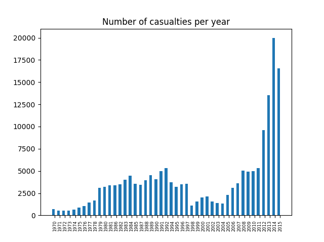	
	
Graphs look similar, so we can conclude that the general number of attacks per year has grown along with the number of casualties accordingly, which is not surprising.

Okay, but are all these attacks lethal? It wouldn't be that dangerous if the attackers' point was just to attract the public attention for some reason but without any victims... let's check this out.
	
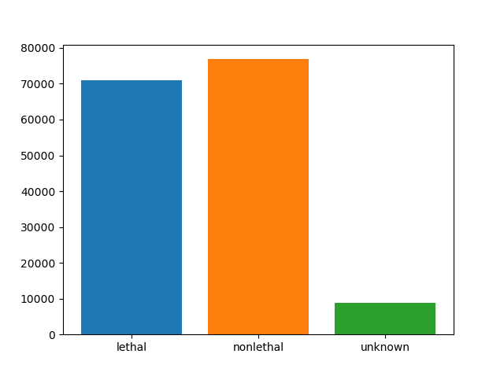

So, it is almost half-half, but still non-lethal attacks' number is bigger.

Let's create a world map where each country is coloured according to the number of attacks, so we have a better visual representation in comparing different countries/regions. 
Light green areas are safest - with least attacks, yellow areas are around the average, and the red ones are most attacked. For the grey areas, like Greenland or Mongolia, we could say that they are outliers because there are no registered attacks ever. Iraq is an outlier too, so is the only one with dark red (alarming) colour because of the enormous number of attacks.

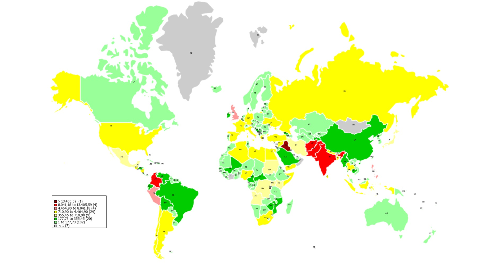

`Note:` Attacks in Caribbean region are not registered on the map. 

Next, we decided to find the city that is the most dangerous. We started by finding what are the cities which have the most attacks. Then, we took the first 5, and checked the probabilities to be killed in any of the attacks in these cities.

 	Chances of being attacked in Baghdad: 0.0249951323988
 	Chances of being killed in an attack in Baghdad: 9.46914505998e-07
 	Chances of being attacked in Karachi: 0.0210257697456
 	Chances of being killed in an attack in Karachi: 3.05751649476e-07
 	Chances of being attacked in Lima: 0.0249976539039
 	Chances of being killed in an attack in Lima: 1.00908584235e-07
 	Chances of being attacked in Belfast: 0.0137818454292
 	Chances of being killed in an attack in Belfast: 1.28352449225e-06
 	Chances of being attacked in Santiago: 0.0192901234568
 	Chances of being killed in an attack in Santiago: 3.1941994905e-08

Probability of around 0.025 means that 1 person in 40 could be attacked. Conclusion is that one is most likely to be attacked in Lima, but most likely to be killed in Belfast if they are attacked.

Considering what concerns us the most, our continent - Europe, we have made the following analysis about 2015, because it's the newest.

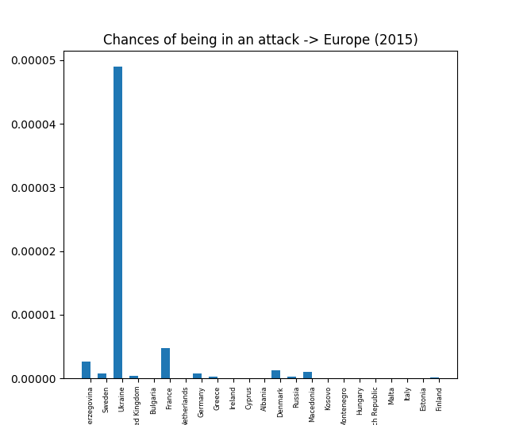
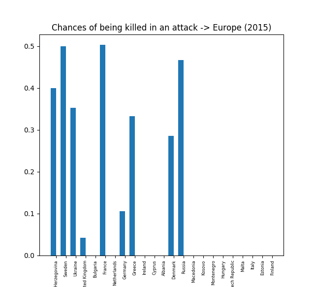

There is about 7 times bigger risk to be attacked in Ukraine than in any other European country. Second is France, but still the difference between both of them is big.

In 6 countries the chance a person to be killed once is attacked is very big, over 30%, and in Denmark almost 30%, which is quite high probability.

Next, using the linear regression as an approach for modelling, we gain the predictions of the number of attacks in Europe in the few following years.

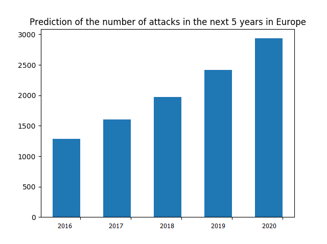

Our prediction is saying that it is expected the number of attacks in future to be growing for about 300 attacks per year, which is alarming.

Considering different regions in Europe, we have found that in Western Europe the number of attacks has been decreasing, generally, but increasing in Eastern.

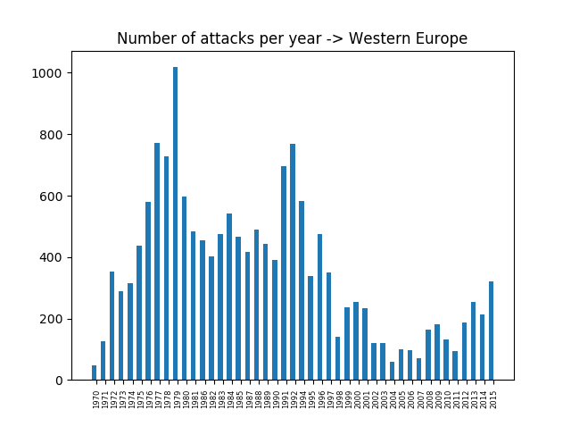
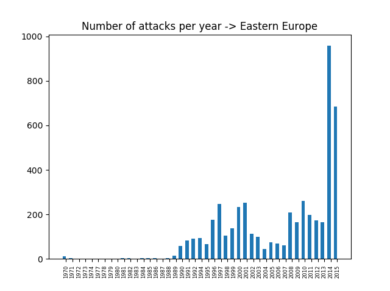

There was a decrease in attacks from 1994, until 2004. From 2004 the number of attacks per year is steadily growing. However, the number of attacks in 2014 is smaller than the number of attacks in 1999, 2000, and 2001 and smaller than most of the years before these. The number of attacks in 2015 is nearly equal to the number of attacks in 1997, and smaller than nearly all years before. We can conclude that there was a decrease in attacks in the past 20 years, and it is now growing again. Unlike Western Europe, the number of attacks in Eastern Europe has grown dramatically in the past 2 years.

Talking about Western and Eastern Europe, the following graphs show us how the probability of being attacked and being killed has been moving in both of them, accordingly.

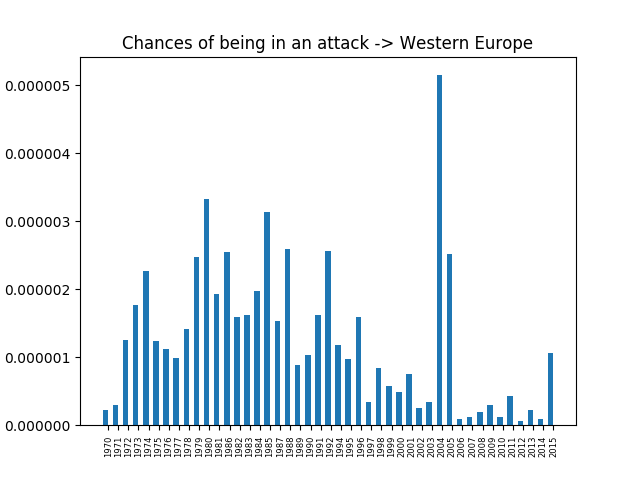
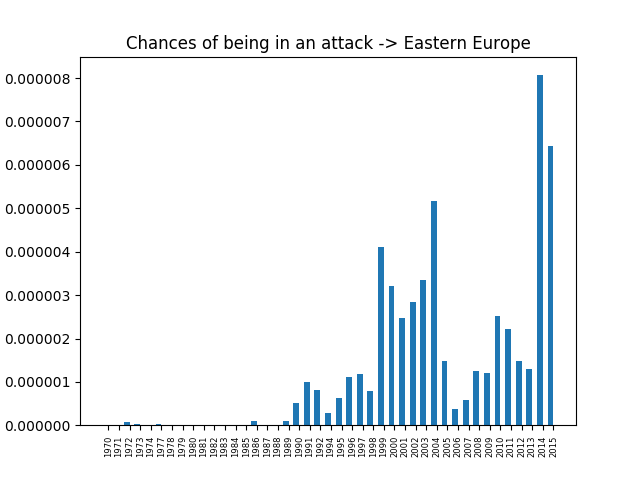

So, we can conclude that in Western Europe the latest years the probability of being attacked has been decreasing, but one outlier (2004) could be noticeable, as an obvious exception. Generally, in Eastern Europe the probability of being attacked increases in the latest years, which is logical conclusion regarding that the number of attacks in the same years has been increased. 

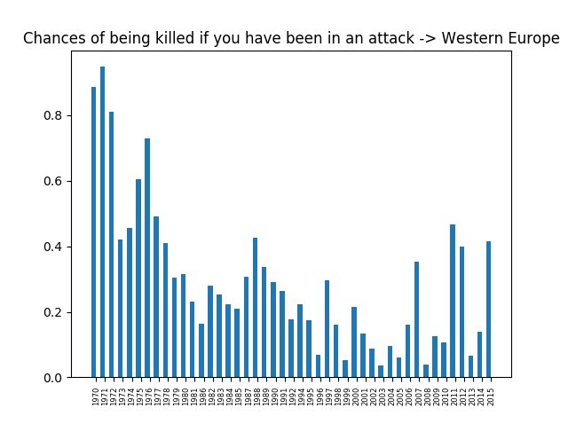
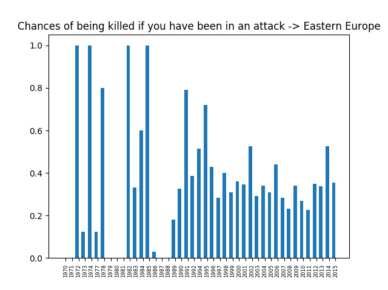

Chances of being killed in Western Europe is moving mostly between 0.2 and 0.4 through the passed years, while in Eastern is a big higher, moving around 0.4 and 0.6 in the widest range of years.  

The specific definition of our goals can be found in the `osnutek.md` file. More detailed analysis about the topic and mid results needed to obtain the above results can be found in `Appendix.md` file.