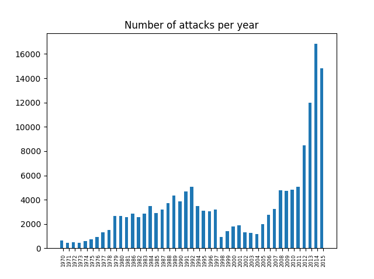
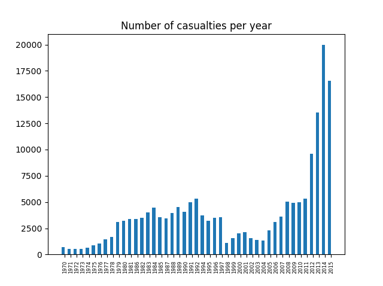
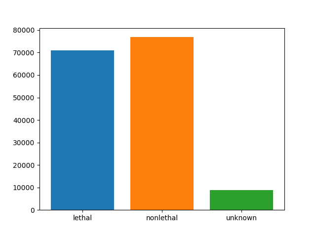
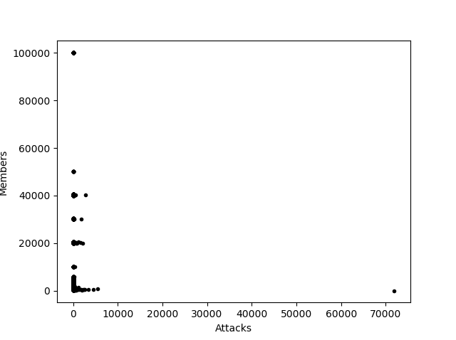
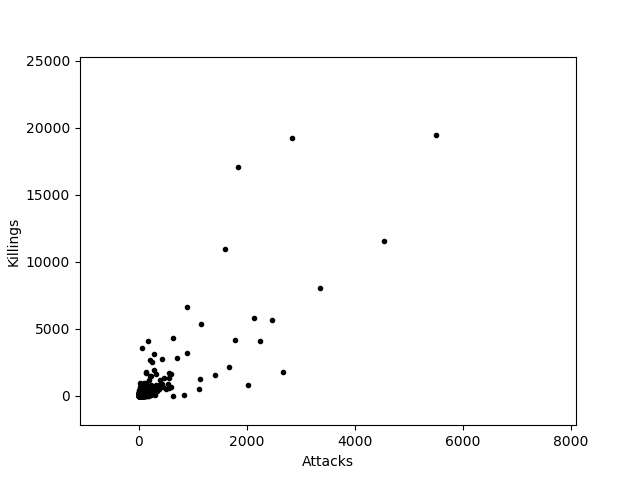
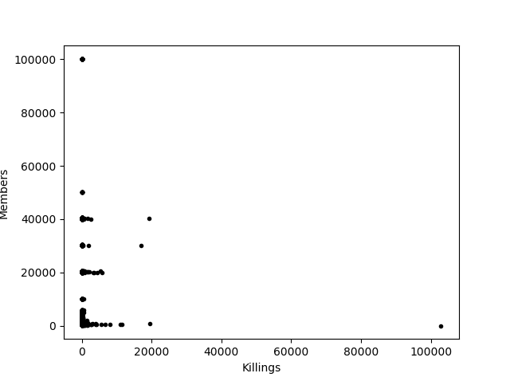
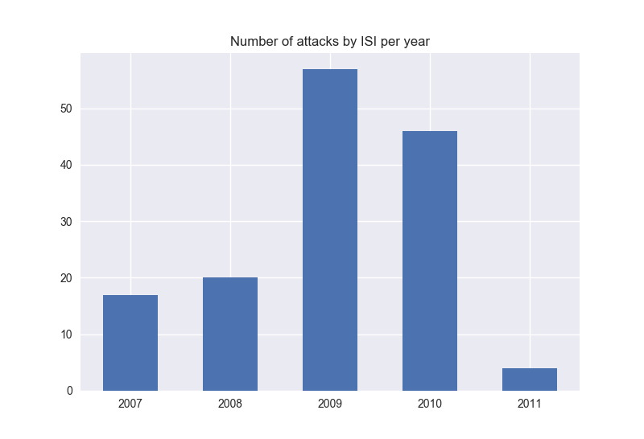

# PR17MTDSZG
## Goals
The data represents all recorded terrorist attacks form 1973, to 2015. We have chosen the following goals:
	
- Number of attacks every year;
- Number of casualties every year;
- Numbers of lethal and non-lethal attacks;
- Correlation between success, suicide attacks;
- What is the most dangerous city/country to live in;
- What is the most dangerous profession to be a part of;
- What is the weapon that is used the most;
- Which are the groups that claim responsibility most often;
- What is the correlation between the number of attacks they have claimed and the number of members they have.
	
## Conclusions
We have come to the following conclusions:
	
### Number of attacks every year:

	
	
We can see that the general number of attacks per year has grown. As well as this, we can see that the number of casualties every year grows accordingly, which is not surprising.
	
### A representation of lethal vs nonlethal attacks:

### The dependence of an attack being a suicide and a success:
	
- P(Success|Suicide)= 0.8928945713686859
- P(Success|not Suicide)= 0.9319741317491332
- P(Success * Suicide)= 0.027173219707600848
- P(Suicide)*P(Success)= 0.02749936858568745

The success of the attack is independent of whether the attack was a suicide.

### The 9 most dangerous cities according to the number of attacks are:
	
	['Baghdad' '6237']
 	['Karachi' '2530']
 	['Lima' '2358']
 	['Belfast' '2102']
 	['Santiago' '1614']
 	['Mosul' '1553']
 	['San Salvador' '1547']
 	['Mogadishu' '1169']
 	['Istanbul' '999']]
	
### But, the 9 most dangerous cities according to the number of victims are:
	
	 ['Baghdad' '18638.800000000003']
	 ['Karachi' '3555.0']
	 ['New York City' '2815.0']
	 ['Mosul' '2743.2']
	 ['Mogadishu' '2485.33']
	 ['Tikrit' '2392.0']
	 ['Beirut' '1963.0']
	 ['Maiduguri' '1958.9999999999998']
	 ['Ramadi' '1853.67']]
	
We can clearly see that the most dangerous city is Baghdad with 6237 attacks and 18638 victims in total. It is interesting to note, however, that the number of attacks and victims alike, for which the city is unknown is bigger than the number of attacks and victims of any known city. It is also notable that there are cities that have been attacked more often, but with less victims, than cities that have been attacked less often but with more victims. For example Lima is not found in the top 10 cities by killings, but it is third in the number of attacks, whereas New York is not in the top 10 in the number of attacks, but is third in the number of victims. However, if we check the numbers, it turns out that Lima has 797 recorded victims, but at the same time it has 227 attacks where the number of victims was unknown. Following this, Santiago has 163 victims, but 264 attacks with unknown number of victims.

### Top 10 countries with most victims:
	
	[['Iraq' '58855.000000000015']
	 ['Afghanistan' '27018.000000000015']
	 ['Pakistan' '21597.0']
	 ['Nigeria' '18508.999999999996']
	 ['India' '18317.0']
	 ['Sri Lanka' '15505.0']
	 ['Colombia' '14562.0']
	 ['Peru' '12752.0']
	 ['El Salvador' '12053.0']
	 ['Algeria' '11082.0']]
	

### Top 10 most attacked countries:
	
	[['Iraq' '18770']
	 ['Pakistan' '12768']
	 ['India' '9940']
	 ['Afghanistan' '9690']
	 ['Colombia' '8077']
	 ['Peru' '6085']
	 ['Philippines' '5576']
	 ['El Salvador' '5320']
	 ['United Kingdom' '4992']
	 ['Turkey' '3557']]
	

### 10 most attacked professions:
	
	[['Private Citizens & Property' '35877']
	 ['Military' '22924']
	 ['Police' '21241']
	 ['Government (General)' '19251']
	 ['Business' '18882']
	 ['Transportation' '6419']
	 ['Utilities' '5504']
	 ['Educational Institution' '3947']
	 ['Religious Figures/Institutions' '3891']
	 ['Unknown' '3805']]
	

It is noticeable  that unknown is only tenth.

### 10 most killed professions:
	
	[['Private Citizens & Property' '117262.86999997996']
	 ['Military' '86367.67999999995']
	 ['Police' '44541.34500000004']
	 ['Government (General)' '23324.845000000016']
	 ['Business' '20065.710000000006']
	 ['Transportation' '13156.06']
	 ['Religious Figures/Institutions' '11690.159998200006']
	 ['Terrorists/Non-State Militia' '7373.67']
	 ['Airports & Aircraft' '3570.49']
	 ['Violent Political Party' '3497.04']]
	

### The weapons that kill the most are:

	
	[['Firearms' '156474.47000000108']
	 ['Explosives/Bombs/Dynamite' '141923.1499999998']
	 ['Unknown' '31880.039999999997']
	 ['Melee' '9802.33']
	 ['Incendiary' '5042.009998179001']
	 ['Vehicle (not to include vehicle-borne explosives, i.e., car or truck bombs)' '3102.0']
	 ['Chemical' '430.0']
	 ['Sabotage Equipment' '49.0']
	 ['Other' '46.0']
	 ['Biological' '9.0']]
	

If we compare these to the weapons used for the 10 deadliest attacks, we can see that they are contained within the deadliest weapons. The weapons used for the 10 deadliest attacks are as follows:
	
	['Incendiary', 1500.0
	'Firearms', 1381.5
	'Vehicle (not to include vehicle-borne explosives, i.e., car or truck bombs)', 1381.5
	'Vehicle (not to include vehicle-borne explosives, i.e., car or truck bombs)', 1180.0
	'Vehicle (not to include vehicle-borne explosives, i.e., car or truck bombs)', 670.0
	'Vehicle (not to include vehicle-borne explosives, i.e., car or truck bombs)', 518.0
	'Firearms', 517.0
	'Incendiary', 500.0
	'Explosives/Bombs/Dynamite', 422.0
	'Firearms',  400.0]
	

### The weapons that are used the most:
	
	[['Explosives/Bombs/Dynamite' '79126']
	 ['Firearms' '51802']
	 ['Unknown' '12388']
	 ['Incendiary' '9812']
	 ['Melee' '3013']
	 ['Chemical' '231']
	 ['Sabotage Equipment' '123']
	 [ 'Vehicle (not to include vehicle-borne explosives, i.e., car or truck bombs)' '104']
	 ['Other' '92']
	 ['Biological' '35']]
	

### Most common types of attacks:
	 
	 [['Bombing/Explosion' '75963']
	 ['Armed Assault' '37554']
	 ['Assassination' '17582']
	 ['Hostage Taking (Kidnapping)' '9115']
	 ['Facility/Infrastructure Attack' '8849']
	 ['Unknown' '5490']
	 ['Hostage Taking (Barricade Incident)' '835']
	 ['Unarmed Assault' '828']
	 ['Hijacking' '556']]
	 

### Deadliest types of attacks:

	 
	 [['Armed Assault' '145287.4699999802']
	 ['Bombing/Explosion' '129276.09999999983']
	 ['Unknown' '23962.840000000004']
	 ['Assassination' '23136.33']
	 ['Hostage Taking (Kidnapping)' '16855.249999999993']
	 ['Hijacking' '3658.0']
	 ['Facility/Infrastructure Attack' '3305.0099981999965']
	 ['Hostage Taking (Barricade Incident)' '2530.0']
	 ['Unarmed Assault' '748.0']]
	 

### Groups that claim responsibility for most lives:
	 
	 [['Unknown' '102910.67000000006']
	 ['Taliban' '19465.0']
	 ['Islamic State of Iraq and the Levant (ISIL)' '19224.33']
	 ['Boko Haram' '17093.000000000007']
	 ['Shining Path (SL)' '11588.0']
	 ['Liberation Tigers of Tamil Eelam (LTTE)' '10964.0']
	 ['Farabundo Marti National Liberation Front (FMLN)' '8065.0']
	 ['Nicaraguan Democratic Force (FDN)' '6662.0']
	 ['Al-Shabaab' '5804.0']
	 ['Revolutionary Armed Forces of Colombia (FARC)' '5651.0']
	 ['Tehrik-i-Taliban Pakistan (TTP)' '5347.0']
	 ['Al-Qaida in Iraq' '4356.799999999998']
	 ["Kurdistan Workers' Party (PKK)" '4190.999999999999']
	 ["New People's Army (NPA)" '4090.0']
	 ['Hutus' '4083.0']
	 ['Al-Qaida' '3608.0']
	 ['Al-Qaida in the Arabian Peninsula (AQAP)' '3197.0']
	 ["Lord's Resistance Army (LRA)" '3107.9999999799998']
	 ['Sikh Extremists' '2812.0']
	 ['National Union for the Total Independence of Angola (UNITA)' '2726.0']]
	 

### Groups that claim responsibility most often:
	 
	 [['Unknown' '71922']
	 ['Taliban' '5502']
	 ['Shining Path (SL)' '4548']
	 ['Farabundo Marti National Liberation Front (FMLN)' '3351']
	 ['Islamic State of Iraq and the Levant (ISIL)' '2833']
	 ['Irish Republican Army (IRA)' '2670']
	 ['Revolutionary Armed Forces of Colombia (FARC)' '2474']
	 ["New People's Army (NPA)" '2241']
	 ['Al-Shabaab' '2127']
	 ['Basque Fatherland and Freedom (ETA)' '2024']
	 ['Boko Haram' '1839']
	 ["Kurdistan Workers' Party (PKK)" '1782']
	 ['Communist Party of India - Maoist (CPI-Maoist)' '1666']
	 ['Liberation Tigers of Tamil Eelam (LTTE)' '1606']
	 ['National Liberation Army of Colombia (ELN)' '1418']
	 ['Tehrik-i-Taliban Pakistan (TTP)' '1153']
	 ['Maoists' '1141']
	 ['Palestinians' '1124']
	 ['Nicaraguan Democratic Force (FDN)' '895']
	 ['Al-Qaida in the Arabian Peninsula (AQAP)' '893']]

### The correlation between the number of members and the number of attacks of a group:
	The Pearson correlation coefficient between the number of attacks and the members of is: -0.0178216906069
	The Pearson correlation coefficient between the number of attacks and the killings of is: 0.965210133435
	The Pearson correlation coefficient between the number of killings and the members of is: -0.0131359157301

It is clear that the number of members does not have much influence neither on the number of attacks, nor on the number of killings. It is unsurprising that the number of attacks and the number of killings are strongly correlated.

### Analysis about ISI attacks:
