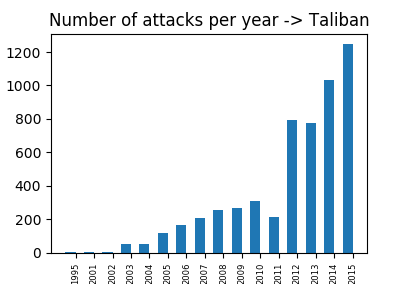
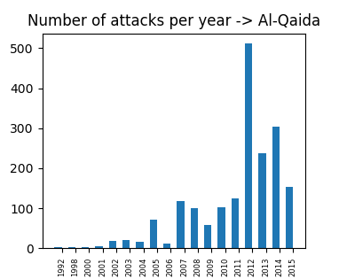
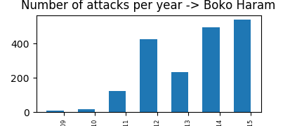

# Analysis of Terrorist Attacks - Report

## Introduction
Terrorism has become a common social issue. It is defined as the unlawful use of violence and intimidation, especially against civilians, in the pursuit of political aims. It seems as tough we hear about terrorism more and more in the news. Which is more, it seems to be close to us. These are the reasons we chose to explore this area and discover how terrorism has been developing and spreading over the years, as well as the dangers it presents over the world in general.

## Results

To begin with, we were interested to see how the number of attacks changes on a global scale. The graphs bellow depict the trends.
	

	

As we can see, until 2012 the number of attacks, and with it the number of victims, albeit flexible, was relatively stable over time. However, it has dramatically grown, and kept growing, since 2012, reaching its peak in 2014. This trend is alarming, the number of attacks in 2014 is almost three times as big as it was in 2011.
It is unsurprising that the graphs for the number of attacks, and number of victims are so similar. 

After this, we wanted to find out which the most dangerous countries were. Below is a map that shows the numbers of attacks. It ranges from green (the safest) to red (the most dangerous), with yellow in between. The grey countries can be considered to be the safest, as there has never been a registered attack there. These countries include Greenland and Mongolia. On the other hand, Iraq stands out on the other side of the spectrum, it is the country with the most recorded terrorist attacks ever, it has had 18770 attacks in the past 50 years.

`Note:` Attacks in Caribbean region are not registered on the map. 

This prompted us to find the city that is the most dangerous. Having found the 5 cities with most attacks, we calculated the probabilities to be in an attack, as well as the probabilities to be killed if one is in an attack, in each of these cities. They are as followes:

 	Chances of being attacked in Baghdad: 0.0249951323988
 	Chances of being killed in an attack in Baghdad: 9.46914505998e-07
 	Chances of being attacked in Karachi: 0.0210257697456
 	Chances of being killed in an attack in Karachi: 3.05751649476e-07
 	Chances of being attacked in Lima: 0.0249976539039
 	Chances of being killed in an attack in Lima: 1.00908584235e-07
 	Chances of being attacked in Belfast: 0.0137818454292
 	Chances of being killed in an attack in Belfast: 1.28352449225e-06
 	Chances of being attacked in Santiago: 0.0192901234568
 	Chances of being killed in an attack in Santiago: 3.1941994905e-08

 As we can see, one is most likely to be attacked in Lima (if they are in Lima). However, if they are attacked, then the chances that they will be killed are highest in Belfast. It is worth noting that these chances are still extremely low.

Next, we were interested in Europe. It seems recently, that the number of attacks in Europe is growing. We represented these numbers on two graphs, representing Eastern and Western Europe. They are shown below.

We can see that there was a decrease in attacks from 1994, until 2004. From 2004 the number of attacks per year is steadily growing. However, the number of attacks in 2014 is smaller than the number of attacks in 2001 and smaller than most of the years before that. The number of attacks in 2015 is nearly equal to the number of attacks in 1997, and smaller than nearly all years before. We can conclude that there was a decrease in attacks in the past 20 years, and it is now growing again. Unlike Western Europe, the number of attacks in Eastern Europe has grown dramatically in the past 2 years.
From this we were interested whether we were more likely to find ourselves in an attack today than in the past. Below are two graphs, representing the change of probability of being in an attack and the probability of being killed in an attack through the years in Eastern as well as Western Europe.

We can see that the chances of being in an attack in Western Europe peaked in 2004, but despite that, they have been near the minimum in more recent years. Unlike this, the chances of being in an attack in Eastern Europe have grown dramatically. 

The chances that one will be killed if they find themselves in an attack, has been reducing in Eastern as well as Western Europe, although they are fluctuating a lot.

After this, we were interested in finding what are the most dangerous countries in Europe. To determine this, we used the data from 2015, as it was the newest available.

The likelihood of being attacked in Ukraine is nearly 7 times as big as in any other country. France comes in the second place. However, the chances of being attacked there are dramatically lower.

The chances of being killed, once one has been attacked are quite big. France seems to be the most dangerous in this respect, withx the probability of just over 0.5. This is quite a high probability, however it should be taken in account that the chance of being into an attack in France is around 0.000005.

Naturally, we were interested in the future, and tried to predict the number of attacks in Europe in the next 5 years. This is difficult to do for various reasons. First, because the dataset we are using is limited, we used a part for learning and a part for testing in order to find out the best method, and then tried to predict the next 5 years. But as well as this, because terrorist attacks are often a reaction to global politics and events that are oftentimes difficult to predict. Therefore, our prediction should be taken as a trend, rather than as set-in-stone numbers.

We can see that the general trend shows that the number of attacks in Europe in the next five years will grow.

As well as this, we were interested in the terrorist groups and their statistics as well.

The group that has performed the most attacks is the Taliban. However, groups that have drawn a lot of attention, whether in recent years, or in the past seem to have performed fewer attacks. For example, ISIL is in the 4th place with 2833 attacks, in contrast with the Taliban, that is 2669 attacks less. Therefore we decided to plot the moving averages of the numbers of attacks of the groups that we have noticed are in the news the most, and compare them.

![Number of attacks by ISIL per year](images/ISIL_over_years.png = 250x250

As we can see from the graphs, Al-Qaida and Boko-Haram have had a smilar number of attack per yer during the years when they hae been active. However, the Taliban and ISIL have had more attacks per year, and in both cases this number has been growing. We can conclude that the only reason that ISIL has fewer attacks than the Taliban is because they have been active only the past few years, but the numbers of their attacks has grown every year since they have been active. As well as this, they have had many more attacks in the first few years of their activity when compared to the Taliban.
 
A lot of the attacks that have happened lately seem to be suicide attacs, we wondered whether suicide attacks had a better success rate than non-suicide attacks. However, after we calculated the probabilities, we determined that the dependence is minimal, with non-suicide attacks being more successeful.	

## Conclusion

From all of this, we can conclude that the number of attacks every year has been growing, and that the whole world is affected by terrorism. The chances of being in an attack are pretty slim, but they still exist. Terrorist groups have come and gone, and they are very likely to continue to do so. It is important to notice that even when we have not had more attacks, we have known more about them, something that is expexted with globalisation and social media.

The definition of our goals can be found in the `osnutek.md` file. Our intermediary results, needed to obtain the above results can be found in `Appendix.md` file.
